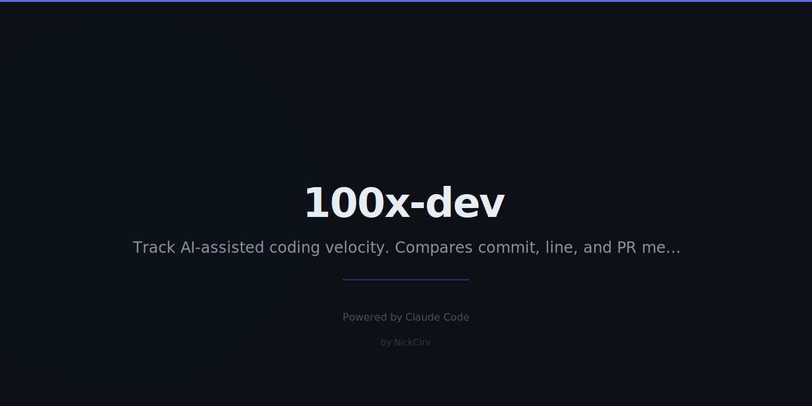

# 100x-dev

> Track your AI-powered velocity.

[](https://www.npmjs.com/package/100x-dev)
[](LICENSE)
[](https://github.com/NickCirv/100x-dev/stargazers)

---

## The Problem

Everyone claims AI makes them 10x. Nobody has the data. `100x-dev` tracks your git history, separates AI commits from human commits, and gives you a real multiplier. Not vibes — math.

---

## Quick Start

```bash
npx 100x-dev start
# ... ship code with Claude ...
npx 100x-dev stop
```

No install needed. Just run in any git repo.

---

## Example Output

```
  100x-dev — AI velocity tracker
  ─────────────────────────────
  Session complete

  47.3x multiplier

  AI    [████████████████████████████░░] 97.9%
  Human [░░░░░░░░░░░░░░░░░░░░░░░░░░░░░░]  2.1%

  ─────────────────────────────
  Duration     2h 14m
  Commits      38 total  36 AI  2 human
  Lines +      +4,832
  Lines −      -1,204
  AI wrote     5,909 lines
  You wrote    127 lines

  🔥 Legendary session. That's 100x energy.
```

---

## Features

- Detects AI commits via Claude Code co-author tags, `[AI]` / `[Claude]` prefixes, and `🤖` annotations
- Calculates a real multiplier: `totalLines / humanLines`
- Lifetime stats across all sessions
- Personal leaderboard of your best sessions
- SVG badge generator — drop your multiplier into any README
- Scorecard card SVG for sharing
- Local-only storage (`~/.100x-dev/sessions.json`) — zero telemetry

---

## How It Works

1. `100x-dev start` — records the current git HEAD as session baseline
2. You commit code (Claude Code auto-tags its commits with `Co-Authored-By`)
3. `100x-dev stop` — walks commits since baseline, classifies each as AI or human via pattern matching, calculates line counts and multiplier, renders the session card

---

## Commands

| Command | Description |
|---------|-------------|
| `100x-dev start` | Begin tracking a session |
| `100x-dev stop` | End session, calculate multiplier |
| `100x-dev stats` | Lifetime stats across all sessions |
| `100x-dev badge` | Generate SVG badge for your README |
| `100x-dev leaderboard` | Personal best sessions |
| `100x-dev export` | Export sessions as JSON |
| `100x-dev reset` | Clear a stuck active session |

### Options

```
start
  -r, --repo <path>    Git repo path (default: cwd)
  -l, --label <name>   Label for this session

badge
  -o, --output <dir>   Output directory (default: .)
  --scorecard          Also generate a scorecard SVG

export
  -o, --output <file>  Output file (default: stdout)
```

---

## Detection Logic

A commit is classified as **AI-written** if the message or body matches any of:

| Pattern | Example |
|---------|---------|
| `Co-Authored-By: Claude` | Added automatically by Claude Code |
| `🤖` in message | Manual tag |
| `[AI]` or `[Claude]` | Manual tag |
| `Generated with [Claude` | Claude Code footer |
| `noreply@anthropic.com` | Anthropic co-author email |

**Multiplier formula:**

```
multiplier = totalLines / humanLines
```

---

## Requirements

- Node.js 18+
- Git installed and in `PATH`

---

## See Also

- [vibe-coding](https://github.com/NickCirv/vibe-coding) — ship entire features from a single prompt
- [dev-journal](https://github.com/NickCirv/dev-journal) — auto-generate daily dev journals from git activity
- [zero-to-prod](https://github.com/NickCirv/zero-to-prod) — scaffold and deploy a full-stack app in one command

---

## License

MIT — [NickCirv](https://github.com/NickCirv)
